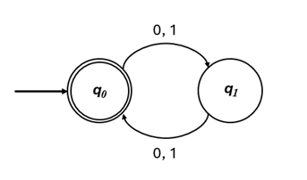
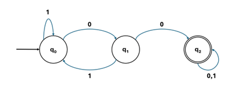

# Task 4:

The **Node** structure is one of the most fundamental data representations in computer science. It serves as the foundation for various complex data structures, including:
- **Linked Lists** (Singly, Doubly, Circular)
- **Trees** (Binary Trees, Binary Search Trees, AVL Trees)
- **Graphs** (Directed, Undirected, Weighted Graphs)
- **Tries** (Used in prefix searching, autocomplete systems)
- **Red-Black Trees & B-Trees** (Efficient self-balancing search structures)
- **Finite State Machines** (For lexical analysis, language processing)


A basic Node struct typically contains:
- **Data:** The value stored in the node.
- **Pointers:** References to other nodes, defining connectivity.
Example: A simple Node structure for a **singly linked list** might look like this:

```cpp
struct Node {
    int data;
    Node* next;

    Node(int value) : data(value), next(nullptr) {}
};
```

Nodes can be adapted to suit various structures by modifying their attributes. In this task, we will modify a _node-based structure_ to implement a **Deterministic Finite Automaton (DFA).**

---

## Deterministic Finite Automaton (DFA)

A **Deterministic Finite Automaton (DFA)** is a theoretical machine used to recognize patterns in input strings. It operates on a finite set of states and follows a fixed set of transitions based on input symbols.

### Formal Definition of a DFA
Mathematically, A DFA is a 5-tuple:

**\[ M=(Q, \Sigma, \delta, q_0, F) \]**

where:
- **\( Q \)**: A finite set of states.
- **\( \Sigma \)**: A finite set of input symbols (alphabet).
- **\( \delta \)**: A transition function \( \delta : Q \times \Sigma \rightarrow Q \) that maps a state and input symbol to a next state.
- **\( q_0 \)**: The initial (starting) state, where processing begins.
- **\( F \)**: A set of final (accepting) states.

For this lab, we will simplify the alphabet to 

\[ \Sigma = \{0, 1\} \]

### Understanding DFA Behavior

Each state in a DFA has:
- A transition on input _0_.
- A transition on input _1_.
- A final state designation (if the machine ends in this state, the input is accepted).

Example: The following DFA accepts binary strings that have an *even number of characters.*

<p align="center">
  
</p>


Consider the string **_001101_**.

The Bold Arrow coming in from no where, indicates the start state **\(q_0\)**. The machine starts reading the input from left to right. It reads _**0**_, moves to **\(q_1\)** . In **\(q_1\)** it reads _**0**_ moves to **\(q_0\)**  and so on. The machine ends in **\(q_0\)** which is an accepting state (as indicated by the double circles).


#### Example Accept/Reject Cases

<div align="center">

| Input String    | Accepted? |
|:---------------:|:---------:|
| _00_            | Yes       |
| _01_            | Yes       |
| _101010_        | Yes       |
| _1101011_       | No        |
| _(empty string)_  | Yes     |

</div>

---


You must implement the following API:


### State (Class)

```cpp
class State {
    bool isFinal; // Flag to check if the state is final.
    State* t0; // Transition on input 0.
    State* t1; // Transition on input 1;

public:
    State(); // Constructor, initializes state as non-final with no transitions.
    void setFinal(); // Marks the state as a final state.
    void setTransition0(State* s); // Sets the transition for input 0.
    void setTransition1(State* s); // Sets the transition for input 1.
    State* getTransition0(); // Returns the state transitioned to on input 0.
    State* getTransition1(); // Returns the state transitioned to on input 1.
    bool isFinalState(); // Returns true if the state is final, otherwise false.
};
```

### DFA (Class)

```cpp
class DFA {
    std::vector<State*> Q; // Set of states in the DFA.
    State* q0; // Pointer to the start state.
public:
    DFA(int n = 0); // Constructor, initializes a DFA with n states.
    ~DFA(); // Destructor, cleans up allocated memory.
    void addState(); // Adds a new state to the DFA.
    void addTransition(int from, char c, int to); // Adds a transition from state 'from' to state 'to' on character 'c'.
    void setFinalState(int i); // Marks state 'i' as a final state.
    void setStart(int i); // Sets state 'i' as the start state.
    bool isComplete(); // Returns true if all states have transitions and a start state is set.
    bool accepts(const std::string& s) const; // Returns true if the DFA accepts the input string 's'.
};
```

### Main Function

In main(),
1. Implement the following DFA using the API you made.

<p align="center">
  
</p>

2. Check if the DFA is complete
3. Generate a set of test strings and verify if the DFA correctly accepts strings that have **_00_** as a substring


